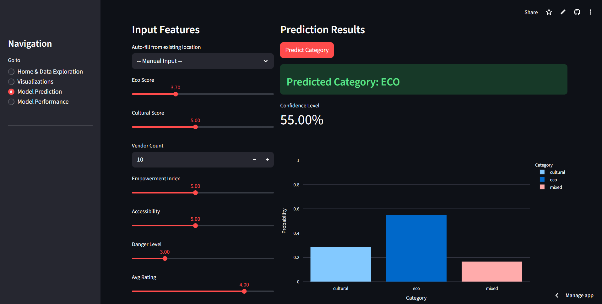
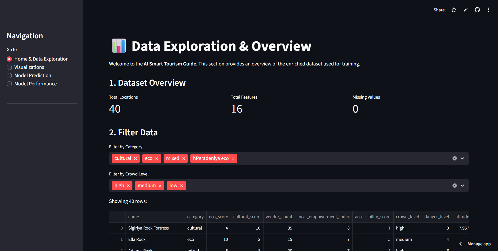

# 🌿 AI-Powered Sustainable Tourism Guide - Sri Lanka


> **A Final Year Project dedicated to promoting eco-friendly travel and smart tourism in Sri Lanka.**

---

## 📖 About The Project

This application is a web-based platform designed to assist tourists in planning sustainable trips across Sri Lanka. By leveraging **Machine Learning** and **Data Analytics**, the system provides personalized travel recommendations, predicts travel costs, and highlights eco-friendly destinations.

The goal is to make tourism in Sri Lanka more accessible while preserving its natural beauty for future generations.

### ✨ Key Features

* **🌍 Smart Destination Recommender:** Suggests places based on user interests (Nature, Culture, Adventure) and sustainability ratings.
* **💰 Budget Predictor:** Uses historical data to estimate travel costs for transportation and accommodation.
* **📊 Interactive Dashboard:** Visualizes tourism trends, weather patterns, and visitor statistics.
* **🌱 Eco-Score System:** Highlights destinations that follow sustainable practices.

---

## 🛠️ Tech Stack

* **Frontend & UI:** [Streamlit](https://streamlit.io/)
* **Backend Logic:** Python
* **Data Manipulation:** Pandas, NumPy
* **Machine Learning:** Scikit-Learn (for predictions)
* **Visualization:** Matplotlib / Seaborn / Plotly

---

## 🚀 How to Run Locally

Follow these steps to set up the project on your local machine.

### 1. Clone the Repository
```bash
git clone https://github.com/KestroyStephan/AI-Smart-Tourism-Prediction.git
cd tourism-application
```

### 2\. Create a Virtual Environment (Optional but Recommended)

```bash
# Windows
python -m venv venv
.\venv\Scripts\Activate

# Mac/Linux
python3 -m venv venv
source venv/bin/activate
```

### 3\. Install Dependencies

```bash
pip install -r requirements.txt
```

### 4\. Run the Application

```bash
streamlit run app.py
```

*The application should open automatically in your browser at `http://localhost:8501`.*

-----

## 📂 Project Structure

```text
├── data/                  # CSV/Excel datasets used for the project
├── notebooks/models       # Saved ML models (e.g., .pkl files)
├── app.py                 # Main Streamlit application file
├── requirements.txt       # List of python dependencies
├── README.md              # Project documentation
└── utils.py               # Helper functions (optional)
```

-----

## 📸 Screenshots


| Home Page | Prediction Page |
|:---:|:---:|
|  |  |

-----

## 🤝 Contact

**Developer:** Stephan Kestroy

  * 📧 Email: stephankestroy@gmail.com
  * 🐙 GitHub: [KestroyStephan](https://github.com/KestroyStephan)

-----

*Created for the Final Year Project 2025.*


